## Running your own bot

Steps below describe how you can run this bot, for example if you want to use it in your server. This guide was written to help even non tech-savvy discord users run their own instance. Following tutorial is targeted mainly for PMaM members, who are familiar with how bot works.

### Step 1: Creating bot account
To make a bot, you firstly need to create bot account. Thankfully it's really easy. Go to [Discord Developer Portal](https://discord.com/developers/applications) and press "New application" button in upper right corner.

Enter a name and press "Create". Go to the **Bot** tab, as seen in the picture below:

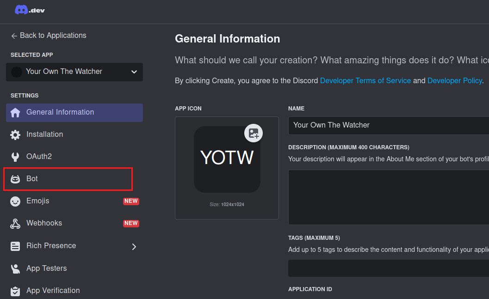

Now change the bot username, avatar and even profile banner. Scroll down a bit and check all **Privileged Gateway Intents** as some parts of the bot rely on them(such as prefix commands, logging and so on). You also might want to uncheck **Public Bot** if you don't want anyone else to add your bot to their servers. 

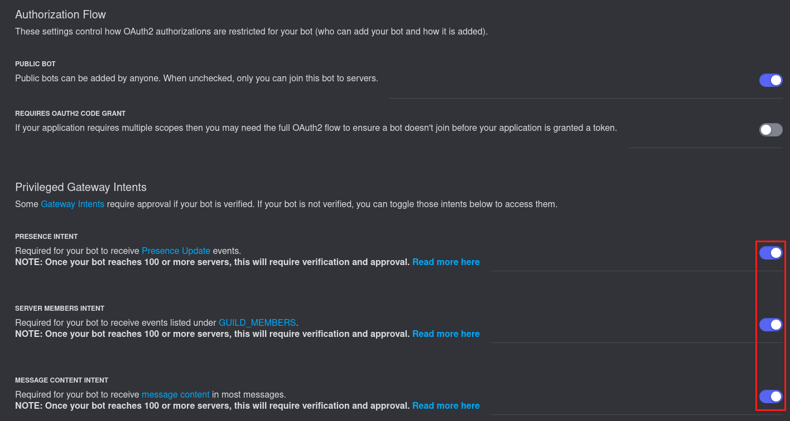

Okay, now comes the exciting part. Press **Reset token** button(it's above **Authorization Flow** section), and copy the token you see to a clipboard. Save it in some secure place, as ANYONE with access to this token is able to control your bot. **So obvoiusly, don't share this token with anyone!**.

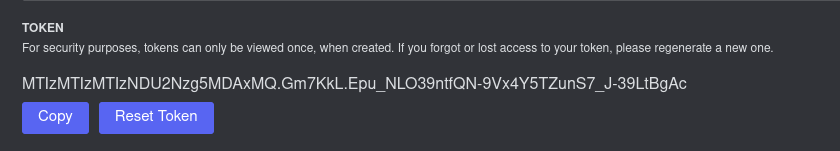

The last part in this section is inviting the bot to your Discord server. Go to **OAuth2** tab, select **bot** in **OAuth2 URL Generator**, and then select all necessary permissions below. Note that you can just give admin perms to the bot, but it's generally considered a bad practice.

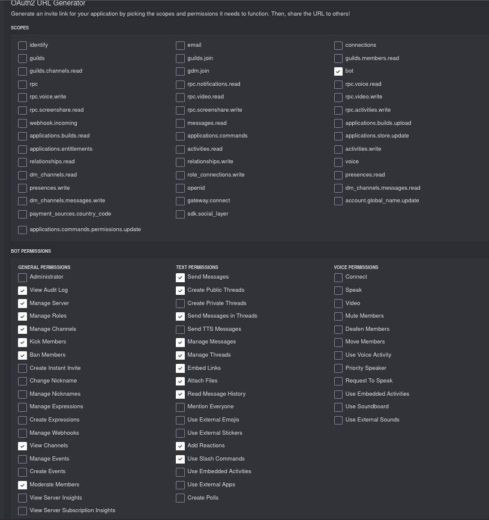

Finally, scroll to the bottom of a page, copy **Generated URL**, paste it in your browser and add a bot to your desired server!

### Step 2: Installing Python and other dependencies

This part of the guide will focus on installing python and requirements needed to run the bot. Firstly, go to https://www.python.org/downloads/ and download the installer from there. Note that if you are using Linux, chances are you already have a Python installed. To verify that, type `python` or `python3` in command line. If you get an error, then you probably don't have it installed.

When installing Python for Windows, make sure you check the option that says "Add Python to enviroment variables" or "Add Python to PATH". If that option is unchecked, you won't be able to run python from command line.

Anyways, after following these instructions, you should have Python properly installed.

Now go ahead and download this git repository(either by using `git clone https://github.com/Portal-Mapping-And-Modding/PMAM-Bot-The-Watcher.git` or just downloading the zip). Unpack it and place all of it's contents in a single folder.

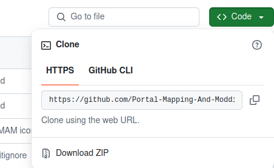

Then, open command line **in the same location.** For example, if you created a folder on desktop named "The_Watcher" and filled it with the files from this repo, your command line prompt should indicate you are in `C:\Users\YourUserName\Desktop\The_Watcher` on Windows or in `~/Desktop/The_Watcher` on Linux. 

Finally, if you are in a correct directory, run `pip install -r requirements.txt`. This command will basically install every required package from the file `requirements.txt`. After that step is done, you are ready to start your bot!

### Step 3: Configuring and starting the bot!

If you are starting the bot for the first time, you need to do some extra steps. As you might already know, The Watcher has EXP system. EXP and user IDs are stored in a database, so lets create one.
```sh
python create_database.py
```
If this command fails, try using `python3` instead of `python`.

Now you can configure EXP system(if you don't want to have EXP system on your server, skip this step). Open `levels.py` file in a text editor, you will need to change following values:

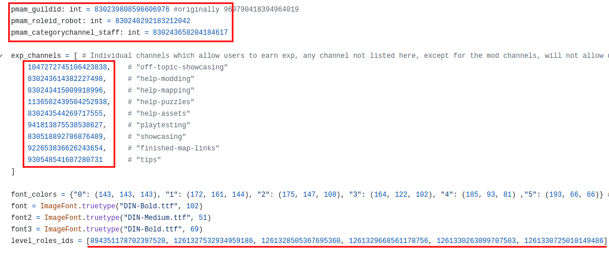

- `pmam_guildid` - change this to the ID of your discord server where you are planning to run the bot. If you don't know how to get this ID, check [this](https://support.discord.com/hc/en-us/articles/206346498-Where-can-I-find-my-User-Server-Message-ID#h_01HRSTXPS5FSFA0VWMY2CKGZXA) guide.

- `pmam_roleid_robot` - change this to the ID of a role that your bot has after joining the server.

- `pmam_categorychannel_staff` - you can leave it as it is, but if you change it to an ID of a category, all channels that are inside of said category will give users EXP if they write in them.

- `exp_channels` - this is a list of all channel IDs where members get EXP. Change it however you like, separate the individual IDs using commas. Also make sure that you don't put comma after the last ID in that list.

- `level_roles_ids` - this is a list of **exactly** six IDs that users get from levelling up. First ID in a list, is an ID of a role "Control group", which all level 0 members have. Next one is a role that you get for getting level 1, and so on. Save all the changes.

Okay that's all when it comes to configuring EXP system(Not exactly! If you are advanced user, you can change EXP thresholds for specific roles, EXP cooldown, even amount of EXP per message, but I wanted to make this guide simple). Before we configure the main bot, we need to edit `pmam_extension.py` a little bit.

Open `pmam_extension.py` and find these variables:

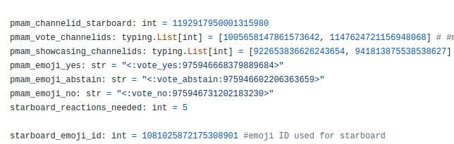

Edit them, so they have correct values:

- `pmam_channelid_starboard` - ID of a channel, that will be used as a starboard. If you don't want starboard functionality, keep on reading.

- `pmam_vote_channelids` - this is a list of channel IDs where `!vote` command can be used. PMaM mods tent to use before making important decisions, and it's quicker than setting up a poll. If you leave it empty (`pmam_vote_channelids: typing.List[int] = []`), the `!vote` command will be effectively disabled.

- `pmam_showcasing_channelids` - another list, this one stores all channel IDs, where people showcase their maps. Any message sent there(if it contains link to a steam workshop), will be automatically used to create a thread. If you don't want this behavior, you can always leave it empty.

- `pmam_emoji_yes` - custom emoji name **and** an ID used in a `!vote` command. We recommend that you use emoji similar to "✅".

- `pmam_emoji_abstain` and `pmam_emoji_no` - basically the same as above, remember that if you disabled `!vote` command entirely, you can just skip configuring these emoji names.

- `starboard_reactions_needed` - number of reactions that message needs to get before it is send in a starboard channel.

- `starboard_emoji_id` - just an ID of a custom emoji, that you want to use a starboard-triggering emoji.

Finally we can edit the main bot file. Open `pmam_bot.py` and edit following values:

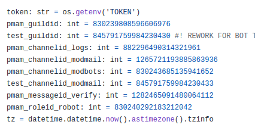

- `pmam_guildid` - change this to the ID of your discord server where you are planning to run the bot.

- `pmam_channelid_logs` - change this to an ID of a channel, where you want the log messages to be send(User joined, message deleted, message edited, and so on). If this channel is hidden from a public(and it should be), **make sure that bot actually has access to it.**

- `pmam_channelid_modmail` - ID of a channel, where bot will send messages that it receives via modmail. Also should be probably hidden/private channel

- `pmam_channelid_modbots` - ID of a channel, where bot will send its "personal logs"(for example if you run out of memory on your host machine).

- `pmam_messageid_verify` - an ID of a message that is resistant to `!purge` commands.

- `pmam_roleid_robot` - change this to the ID of a role that your bot has after joining the server.

You don't have to change variables that start with "test" (`test_guildid`, `test_channelid_modmail`). Now go to the 57th line of code and remove `self.restart.start()`. Generally, bot uses it to restart automatically, but it's kind of difficult to set up and it's out of scope of this tutorial.

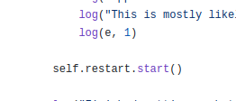

Next thing you want to change is the ID of a role that bot gives to members after they verify. Go to 346th and 151th line, and replace the default ID with the ID of your "Control group" role. As you can also see, here you can change how old the account needs to be in order to be properly verified. 

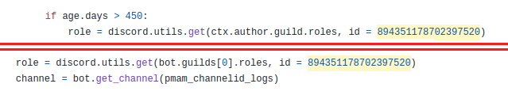

You can also go the line 44 and 45, and remove them if you don't want to have starboard functionality and/or EXP functionality:

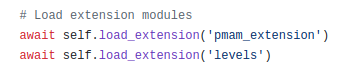

Finally, in the same directory, create a `.env` file. No name, just `.env`. The `.env.txt` won't work. Open this file and paste there `TOKEN=<YOUR_BOT_TOKEN>`, replacing `<YOUR_BOT_TOKEN>` with the token you created back in step 1. The file should look similar to this:

```
TOKEN=MTIzMTI5OTkzNDU2Nzg5MDAxMQ.GzHOC9.ILjKLA8ycLRavp9TyV5noj_Bxf6aZkk6IuvC4U
```

Now enter the following command, and if everything goes well, you should have a working bot!

```sh
python pmam_bot.py
```

### Closing words

Congrats if you made it this far! I know that this tutorial is extremely long, but in the future, we will probably create a simple script that will do all the installation for you. If you have any problems, feel free to conctact us in PMaM server.